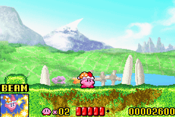
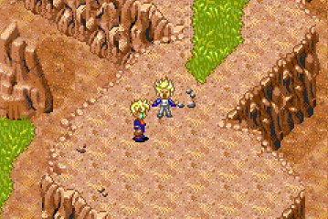

# RustBoyAdvance-NG

  

Nintendo GameBoy Advance ™ emulator and debugger, written in rust.


<div align="center">

</div>

WebAssembly Demo: https://michelhe.github.io/rustboyadvance-ng/ 

# Project Structure
* `core/` - Main emulator crate
* `bindings/` - Bindings to other languages. Currently only java binidings through JNI.
* `platform/` - Constains executables & application built with `rustboyadvance-core`
    * `platform/rustbodyadvance-wasm` - Web emulator powered by WebAssembly
    * `platform/rustbodyadvance-sdl2` - Desktop application built with sdl2
    * `platform/rustbodyadvance-minifb` - Desktop application built with minifb, *not maintained*.
    * `platform/android` - A PoC Android application.

# Progress


## Emulation Todo:
* CGB audio (4 wave generator channels)

# Build and usage (Desktop Application)

To get started, you need to get a [stable rust toolchain](https://rustup.rs) of version Rust 1.51 or later,

## Linux build dependencies
Install SDL2 dependencies

```bash
sudo apt-get -y install libsdl2-dev libsdl2-image-dev
```

## Windows build dependencies
SDL2 runtime binaries are included in this repository, no extra setup needed.

## Build & Usage
You need to obtain a gba bios binary.
An [open source GBA bios](https://github.com/Nebuleon/ReGBA/blob/master/bios/gba_bios.bin) is also available and supported.


Place the bios file in the repository root and name it `gba_bios.bin` (or alternatively use the `-b` command line option)


Build and run in release mode (performance is terrible in the `dev` profile)
```bash
$ cargo run --release -p rustboyadvance-sdl2 -- path/to/rom
```


You can also drag&drop rom files or any zip files containing `.gba` files inside into the emulator window and a new rom will be loaded.

## Key bindings

> Currently the key bindings are not configureable.

GBA key bindings:

| Keyboard  	| GBA      	|
|-----------	|----------	|
| Up        	| Up       	|
| Down      	| Down     	|
| Left      	| Right    	|
| Right     	| Right    	|
| Z         	| B Button 	|
| X         	| A Button 	|
| Return    	| Start    	|
| Backspace 	| Select   	|
| A         	| L        	|
| S         	| R        	|

Special key bindings
| Key          	| Function          	|
|--------------	|--------------------	|
| Space (hold) 	| Disable 60fps cap  	|
| F1		| Custom debugger (requires --features debugger) |
| F2		| Spawn gdbserver (experimetnal, requires --features gdb) |
| F5           	| Save snapshot file 	|
| F9           	| Load snapshot file 	|


# Android Application

The android project is placed inside `platform/android`.
To build it, open it with Android Studio.

You also need to set up rust to build android targets with NDK.

TODO - instructions

# More Screenshots
  

# Links and attribution

- [ARM7TDMI Technical Reference Manual](http://infocenter.arm.com/help/topic/com.arm.doc.ddi0210c/DDI0210B.pdf)
    Technical Reference Manuals are **fun**.
- [GBATEK](http://problemkaputt.de/gbatek.htm)
    A single webpage written by *no$gba* developer Martin Korth.
    This page has pretty much everything. Seriously, it's the best.
- [TONC](https://www.coranac.com/tonc/text/)
    A comprehensive GBA dev guide that I used a-lot in order to understand the GBA system.
    Comes with neat demo roms that really helped me during development and debugging.
- [NanoboyAdvance](https://github.com/fleroviux/NanoboyAdvance)
    A GameBoy Advance emulator written in C++17 by a nice person called fleroviux.
    I've used this for debugging.
- [Eggvance gba-suite](https://github.com/jsmolka/gba-suite)
    Incredible test suite for the arm7tdmi interpreter that I'm using, written by Julian Smolka.
