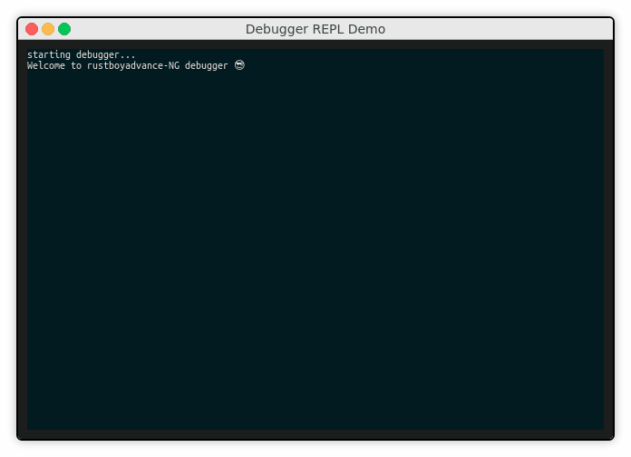

# RustBoyAdvance-NG

[](https://travis-ci.com/michelhe/rustboyadvance-ng)

RustBoyAdvance-NG aims to be a Nintendo GameBoy Advance emulator and debugger, written in the rust programming language.

RustBoyAdvance-NG currently has implemented
  - Dumbed-down ARM mode disassembling
  - A neat debugger REPL

But the way for full emulation is way far ahead, because most of the ARM/THUMB instructions are not yet implemented.

# Using the REPL

You need to have rust installed, and somehow legally obtain a gba bios binary.
Currently to test the debugger, any binary file containing arm mode instructions will do.

```bash
$ cargo run -- debug
```



# Why is this project needed ?

It's actually **not**. There are quite a lot of GBA emulators, and even some written in rust.

I'm only doing this as a side project intended for learning rust.

This is my *third* take on this project. My first go at this was about 3 years ago, but I didn't like rust much at the time so it got abandoned.
I tried to resurrect it a year ago but didn't have the time to get invested in a side-project, let alone learning rust.

I've grown to like rust a lot since then, so here we go again.
You know what they say, *third time's a charm*.

# Links

- [ARM7TDMI Technical Reference Manual](http://infocenter.arm.com/help/topic/com.arm.doc.ddi0210c/DDI0210B.pdf)
    Technical Reference Manuals are **fun**.
- [GBATEK](http://problemkaputt.de/gbatek.htm)
    A single webpage written by *no$gba* developer  Martin Korth.
    This page has pretty much everything. Seriously, it's the best.